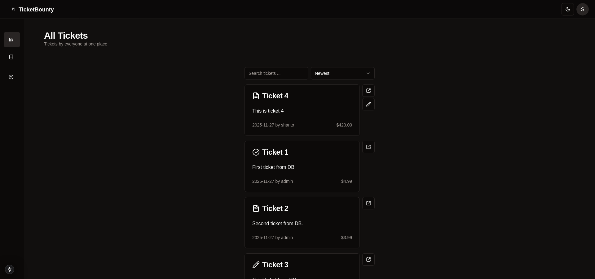

# Ticket Bounty
A ticket-based bounty board where users post tasks with a deadline and reward, and the community comments and collaborates to get them done.

---

## Table of Contents
- [About the Project](#about-the-project)
- [Project Overview](#project-overview)
- [Key Features](#key-features)
- [Tech Stack](#tech-stack)
- [Dependencies](#dependencies)
- [Installation️ and Setup](#installation%EF%B8%8F-and-setup)
- [Folder Structure](#folder-structure)
- [How to Contribute](#how-to-contribute)
- [Contact](#contact)

---

## About the Project
Ticket Bounty is a full-stack Next.js application for posting and tracking bounty-based tickets. Users sign up, create tickets with a title, description, deadline, and cash bounty, and track progress through statuses (Open, In Progress, Done). Other users can comment on tickets, and ticket owners can manage status, edit, or delete their own tickets. It solves the problem of coordinating small paid tasks/bounties in one lightweight, self-hostable app rather than spreading them across chat threads or spreadsheets.

---

## Project Overview

The app is built on the Next.js App Router with server actions for all mutations (auth, tickets, comments) and a Postgres database via Prisma. Key objectives:
- Provide session-based authentication without a third-party auth provider (custom Lucia-style session handling with Argon2 password hashing).
- Let any signed-in user browse all tickets, but only manage (edit/delete/change status of) their own.
- Support searching, sorting, and paginating tickets, plus cursor-based infinite scrolling for ticket comments.
- Store monetary bounty values as integer cents internally and format them as currency for display.

---

## Key Features
- **Authentication** — Email/password sign up and sign in, secure Argon2 password hashing, HTTP-only session cookies, and protected `(authenticated)` route group.
- **Ticket Management** — Create, edit, delete tickets, and update their status (Open / In Progress / Done) via a dropdown menu, with ownership checks enforced server-side.
- **Comments with Infinite Scroll** — Cursor-paginated comments per ticket, loaded via `react-intersection-observer` and React Query as the user scrolls.
- **Search, Sort & Pagination** — Debounced search input, sortable ticket list (newest/oldest/bounty), and page-size-configurable pagination, all synced to the URL via `nuqs`.
- **Account Management** — Dedicated profile and password tabs under `/account`.
- **Theming** — Light/dark mode toggle powered by `next-themes`.
- **Responsive Navigation** — Collapsible hover-expandable sidebar and a fixed header with auth-aware actions.
- **Toast Notifications & Redirect Feedback** — Cookie-based one-time toast messages (e.g. "Ticket deleted") shown after redirects, plus inline action-state toasts for form submissions.
- **REST API Routes** — `/api/tickets` and `/api/tickets/[ticketId]` expose ticket data as JSON alongside the server-rendered pages.

---

## Tech Stack
**Frontend:** Next.js (App Router) · React · TypeScript · Tailwind CSS · shadcn/ui (Radix UI primitives) · TanStack React Query · nuqs

**Backend:** Next.js Server Actions & Route Handlers · Prisma ORM · PostgreSQL

**Auth & Security:** Custom session-based auth (`@oslojs/crypto`, `@oslojs/encoding`) · `@node-rs/argon2` password hashing

**Tools:** ESLint (with `simple-import-sort`) · Prisma CLI · `tsx` (DB seeding) · Git

---

## Dependencies
Major libraries used in this project (see `package.json` for the full, versioned list):
```json
{
  "next": "15.0.7",
  "react": "19.0.0-rc",
  "react-dom": "19.0.0-rc",
  "typescript": "^5",
  "tailwindcss": "^3.4.1",
  "@prisma/client": "^5.22.0",
  "prisma": "^5.22.0",
  "@tanstack/react-query": "^5.59.20",
  "zod": "^3.23.8",
  "nuqs": "^2.1.1",
  "@node-rs/argon2": "^2.0.0",
  "@oslojs/crypto": "^1.0.1",
  "@oslojs/encoding": "^1.1.0",
  "big.js": "^6.2.2",
  "date-fns": "^3.6.0",
  "fastest-levenshtein": "^1.0.16",
  "sonner": "^1.7.0",
  "lucide-react": "^0.454.0",
  "next-themes": "^0.4.3",
  "react-day-picker": "^8.10.1",
  "react-intersection-observer": "^9.13.1",
  "use-debounce": "^10.0.4"
}
```

---

## Installation️ and Setup
1. Clone the repo and install dependencies:
```bash
git clone "https://github.com/shantoopaul/ticket-bounty.git"
cd ticket-bounty
npm install
```

2. Set up environment variables by creating a `.env` file in the root directory:
```env
DATABASE_URL=your_postgres_connection_string
DIRECT_URL=your_postgres_direct_connection_string
```

3. Generate the Prisma client and apply the schema (runs automatically via `postinstall`, or manually):
```bash
npx prisma generate
npx prisma db push
```

4. (Optional) Seed the database with sample users, tickets, and comments:
```bash
npm run prisma-seed
```

5. Run the application:
```bash
npm run dev
```

---

## Folder Structure
```plaintext
ticket-bounty/
│
├── prisma/
│   ├── schema.prisma        # User, Session, Ticket, Comment models
│   └── seed.ts               # DB seed script
│
├── src/
│   ├── app/                  # Next.js App Router pages & layouts
│   │   ├── (authenticated)/  # Protected routes: account, tickets
│   │   ├── api/tickets/      # REST route handlers
│   │   ├── sign-in/ sign-up/ password-forgot/
│   │   └── _navigation/ _providers/
│   │
│   ├── components/           # Shared UI components (form, ui/, etc.)
│   ├── features/             # Feature modules
│   │   ├── auth/              # Sign in/up/out, session handling
│   │   ├── comment/            # Comment actions, queries, components
│   │   ├── password/           # Password hashing utilities
│   │   └── ticket/             # Ticket actions, queries, components
│   │
│   ├── lib/                  # Prisma client, session logic, utils
│   ├── types/                # Shared TypeScript types
│   ├── utils/                # Crypto, currency, URL helpers
│   └── paths.ts              # Centralized route path helpers
│
└── package.json
```

---

## How to Contribute
  - Fork the Project
  - Create a branch (`git checkout -b feature/AmazingFeature`)
  - Commit changes (`git commit -m 'Add some AmazingFeature'`)
  - Push the branch (`git push origin feature/AmazingFeature`)
  - Open a Pull Request

---

## Contact
[Portfolio](https://shantoopaul.vercel.app/)
